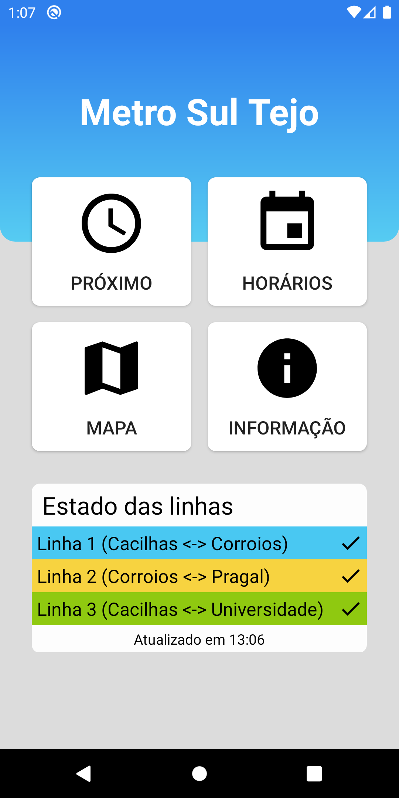
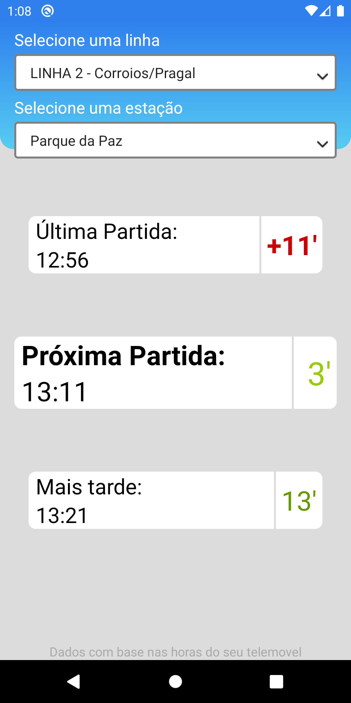
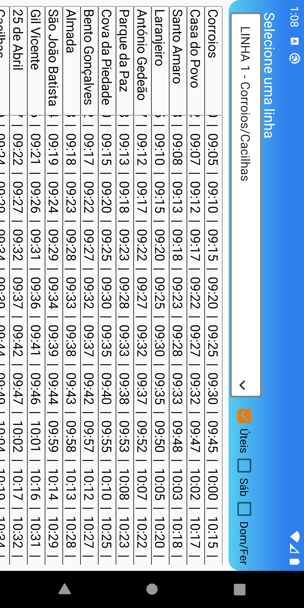
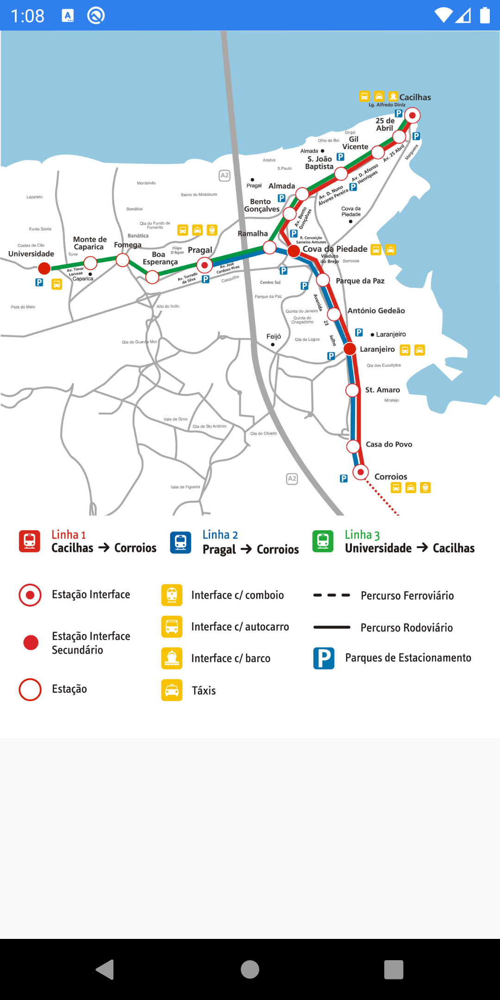
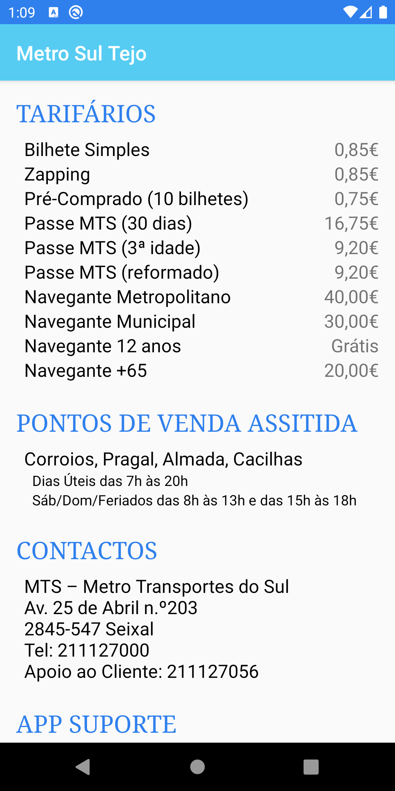

# METRO SUL TEJO
Android application that shows information regarding Metro Transportes do Sul timetables.

## Available on

## Main features
* Consult the full schedule of the three lines in both directions;
* Calculate the remaining time until the metro reaches one of the stops, based on the time of your mobile phone;
* Confer the map with the complete metro network;
* View other kinds of informations like prices and points of contact.

## Screenshots

## Disclaimer
We remind you that this is not an official application of Metro Transportes do Sul and that the schedules should only serve as a reference, and can be changed by operators without prior notice.
